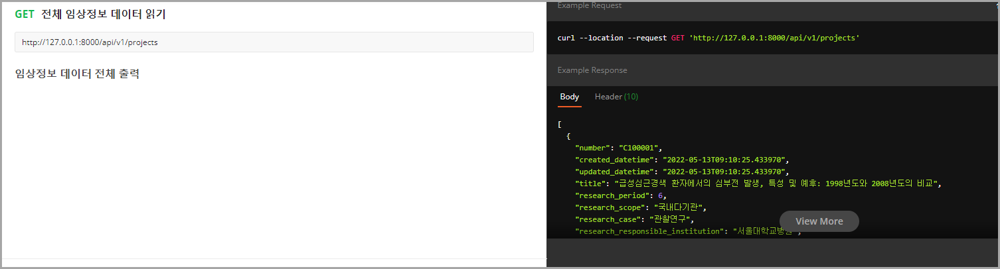
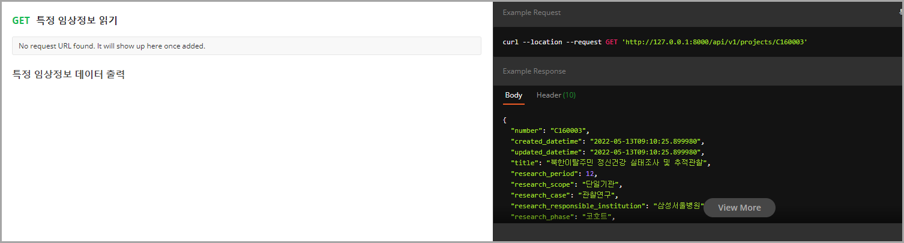
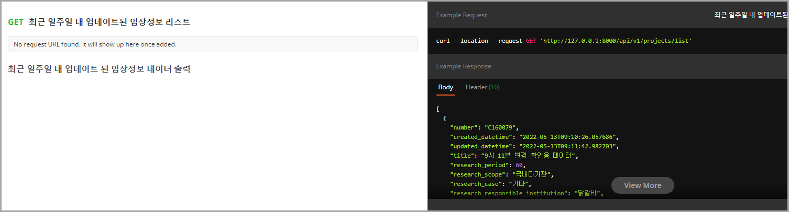

# Humanscape

<div align="center">
  
  
  
</div>

## Contexts
* [Guides](#guides)
* [API Documentation](#api-documentation)
* [Comments](#comments)

</br>

## Version 및 Tools
* Python 3.10
* Django 4.0
* MySQL

</br>

## Modeling


<div align="center">

| 한글 컬럼명 | 영문 컬럼명 | 추가 설명 |
|------------|------------|-----|
| 과제번호 | number | PK |
| 과제명 | title | 길이 편차가 커서 확장성 고려하여 TextField로 결정 |
| 연구기간 | research_period | 기간에 따른 검색 기능 고려하여 PositiveSmallIntegerField로 결정 |
| 연구범위 | research_scope |  |
| 연구종류 | research_case |  |
| 연구책임기관 | research_responsible_institution |  |
| 임상시험단계(연구모형) | research_phase |  |
| 전체목표연구대상자수 | total_subject_count | 대상자수에 따른 검색 기능 고려하여 PositiveIntegerField로 결정 |
| 진료과 | speciality |  |
|  |  |  |
</div>

</br>

## Guides
해당 레포지토리를 clone한 뒤, 다음과 같이 `.env`파일을 프로젝트 폴더 최상단에 작성한다.

```shell
SECRET_KEY=$DJANGO_SECRET_KEY
API_KEY=$OPENDATA_API_KEY

# django.db.backends.mysql
MYSQL_DATABASE=$DATABASE_NAME
MYSQL_USER=$USER_NAME
MYSQL_PASSWORD=$PASSWORD
MYSQL_HOST=$HOST
MYSQL_PORT=$PORT_NO
```

가상 환경 설정 및 라이브러리 설치는 OS별 아래의 링크를 따르도록 한다.
* [MAC](./src/docs/mac.md)
* [WindowOS](./src/docs/windowos.md)
* [Linux](./src/docs/linux.md)

</br>

## API Documentation






🌐[API Documentation Link](https://documenter.getpostman.com/view/12508509/Uyxhn7cA)

</br>

## Comments
<span color="lightgray">금번 프로젝트를 진행하며 겪은 내용과 구현 방법 및 도입 이유 등을 각자가 정리할 예정.</span>

## 장우경

### 최근 일주일내에 업데이트(변경사항이 있는) 된 임상정보 리스트 API
1. 데이터 처음 저장시 TimeStampModel를  created_datetime과 updated_datetime

### 어려워던 점

</br>

## 홍은비

### 각자 맡은 API 또는 구현한 기능
1. something

### 어려워던 점
어려웠던 부분 서술

</br>

## 진병수

### 각자 맡은 API 또는 구현한 기능
1. something

### 어려워던 점
어려웠던 부분 서술

</br>

## 김수빈

### 각자 맡은 API 또는 구현한 기능
1. something

### 어려워던 점
어려웠던 부분 서술

</br>